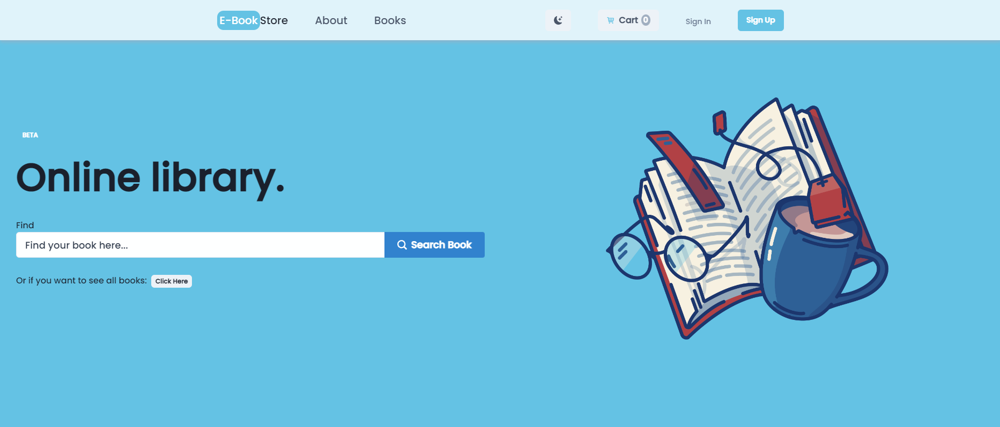

<h1 align="center">Hi 👋, I'm Gabriel Denis</h1>
<h3 align="center">A Fullstack developer from Argentina!!</h3>

<h3>About me:</h3>

I started in the world of programming because I was always interested in technology and curious about its inner workings. I started my journey learning Python data structures, sorting algorithms, n-ary trees, graphs, etc. I am currently training to develop as a Full Stack Developer and longed to get my first work experience in the same field. 

I have the necessary skills to contribute knowledge to the company that decides to bet on me, I have had the opportunity to develop soft communication skills thanks to working in the family business serving clients, I am confident that I have good programming and teamwork skills. It is my goal in the future to be able to develop personally and professionally in the software development industry and to be able to work happily on it.

- 🔭 I worked on [Ebook-store App](https://e-commerce-book-store.vercel.app/books), this project was very challenging in the aspect of code and learning how to work as a team member. This project took around 3 weeks of planning, coding, and styling in which i participated in all three. I loved the team that i worked in and i spect to work on many projects like this in the future.

- 🔭 I worked on [Dogs App](https://github.com/GabrielDenis/PI-Dogs), this project was a great experience to take all the knoledge i have been accumulating from all the years i had been studying different technologies but never got to implement all together. Although this was my fisrt project and it has errors i feel very proud of it!

- 🌱 I’m currently learning **TypeScript | Angular | GO**

- 💬 Ask me about **Python | JavaScript | React | PostgresSQL | Sequalize | Redux**

- 📫 How to reach me **gabrielemidenis@gmail.com**

<h3 align="left">Connect with me:</h3>

<h3 align="left">Languages and Tools:</h3>

                

